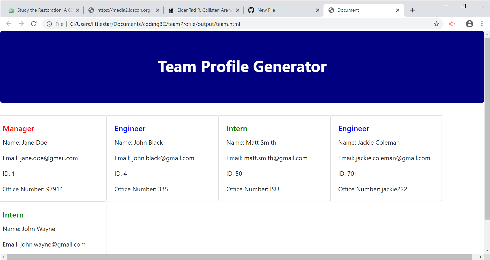

# teamProfile
Built a software engineering team generator command line application. The application prompts the user for information about the team manager and then about the team members. The user can input any number of team members, which may be a mix of engineers and interns. When the user has completed building the team, the application will create an HTML file that displays a nicely formatted team roster based on the information provided by the user.

